<p align="center">
  
</p>

<h1 align="center">VK DUMP Reader</h1>

<p align="center">
  Офлайн-читалка архивов (дампов) ВКонтакте для Android.<br/>
  Импорт .zip / .rar одной кнопкой, переписки, вложения, профиль и медиа — без интернета и без входа в аккаунт.
</p>

<p align="center">
  <a href="https://github.com/Helandy/VK-DUMP-Reader/releases/latest">
    
  </a>
  <a href="https://github.com/Helandy/VK-DUMP-Reader/releases/latest">
    
  </a>
  <a href="https://github.com/Helandy/VK-DUMP-Reader/releases">
    
  </a>
  <a href="https://github.com/Helandy/VK-DUMP-Reader/stargazers">
    
  </a>
</p>

<p align="center">
  
  
  
  
</p>

---

## Что это

**VK DUMP Reader** — нативное Android-приложение, которое превращает выгрузку ВКонтакте в удобную
читалку. Вы отдаёте приложению архив (`.zip` / `.rar`) или уже распакованную папку — оно само
определяет формат дампа, разбирает переписки, вложения и профиль и раскладывает всё по знакомым
экранам: диалоги, чат, медиа, друзья, группы, сохранённые фотографии.

Всё работает **локально и офлайн**: приложение не логинится во ВКонтакте, не обращается к API и
ничего не выгружает наружу. Архив просто копируется в память приложения и читается оттуда.

Поддерживаются несколько форматов выгрузок, встречающихся в реальной жизни: официальный
JSON-экспорт (`profile.json` + `messages/`) и три HTML-раскладки от разных дамперов — приложение
распознаёт их автоматически, включая случаи, когда экспорт запакован в архив несколько раз подряд.

<p align="center">
  <a href="https://github.com/Helandy/VK-DUMP-Reader/releases/latest"><b>Скачать APK</b></a>
  ·
  <a href="#скриншоты"><b>Скриншоты</b></a>
  ·
  <a href="#возможности"><b>Возможности</b></a>
  ·
  <a href="#для-разработчиков"><b>Для разработчиков</b></a>
</p>

---

## Скриншоты

> На всех скриншотах — тестовый профиль со сгенерированными данными и изображениями.
> Никаких реальных переписок и людей.

<table>
  <tr>
    <td align="center"><b>Профили</b></td>
    <td align="center"><b>Импорт</b></td>
    <td align="center"><b>Диалоги</b></td>
  </tr>
  <tr>
    <td>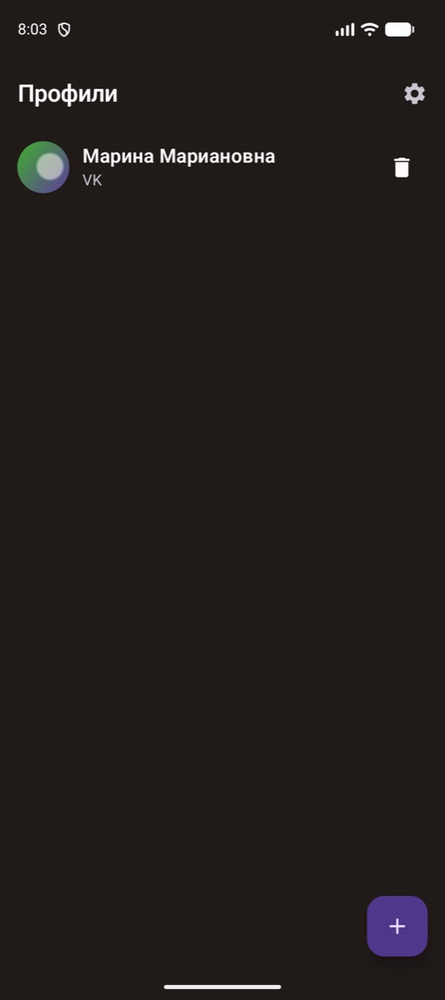</td>
    <td>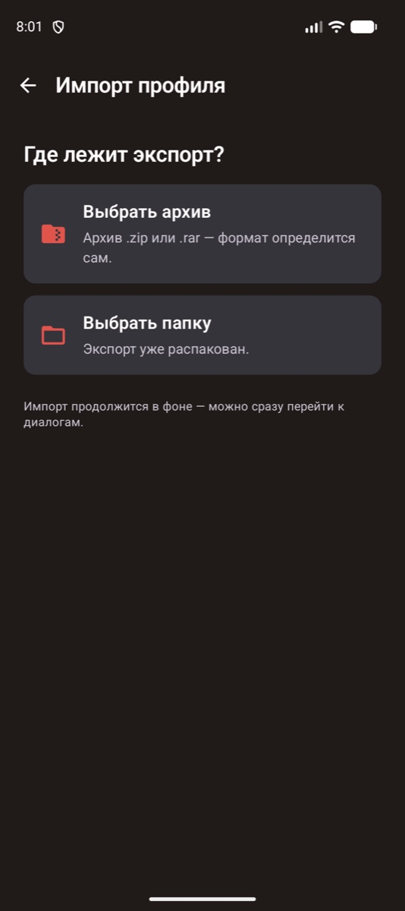</td>
    <td>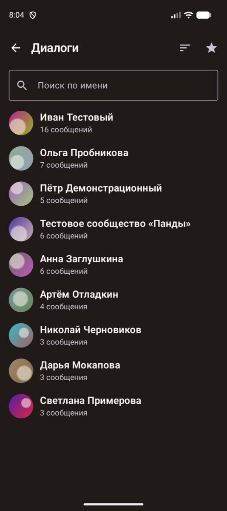</td>
  </tr>
  <tr>
    <td align="center"><b>Чат</b></td>
    <td align="center"><b>Фото в чате</b></td>
    <td align="center"><b>Поиск по сообщениям</b></td>
  </tr>
  <tr>
    <td>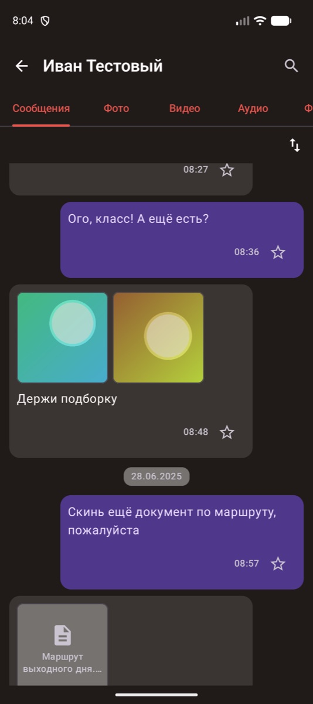</td>
    <td>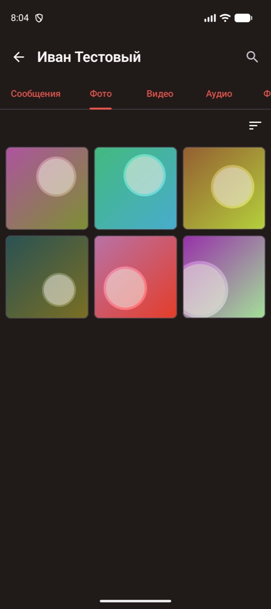</td>
    <td>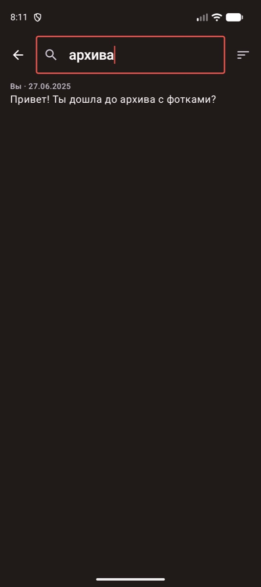</td>
  </tr>
  <tr>
    <td align="center"><b>Профиль</b></td>
    <td align="center"><b>Друзья</b></td>
    <td align="center"><b>Сохранённые фото</b></td>
  </tr>
  <tr>
    <td>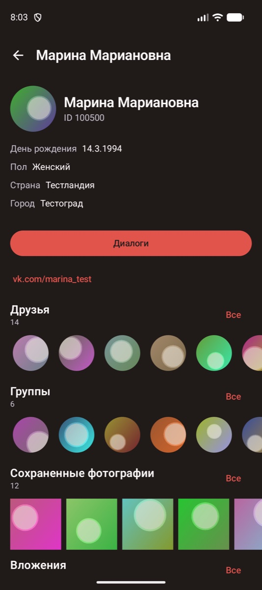</td>
    <td>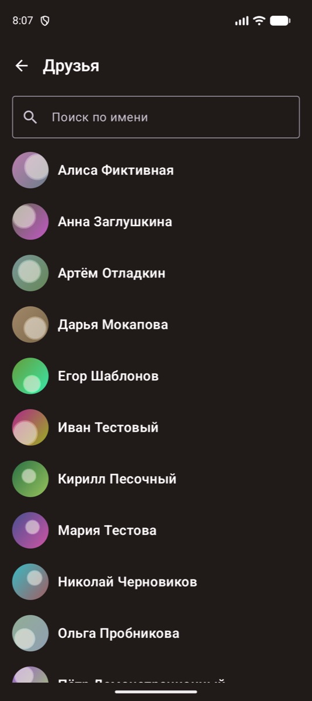</td>
    <td>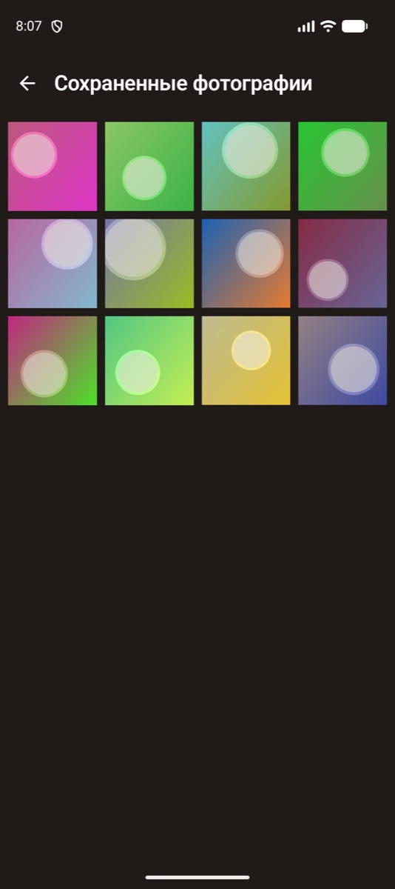</td>
  </tr>
  <tr>
    <td align="center"><b>Файлы архива</b></td>
    <td align="center"><b>Избранное</b></td>
    <td align="center"><b>Настройки</b></td>
  </tr>
  <tr>
    <td>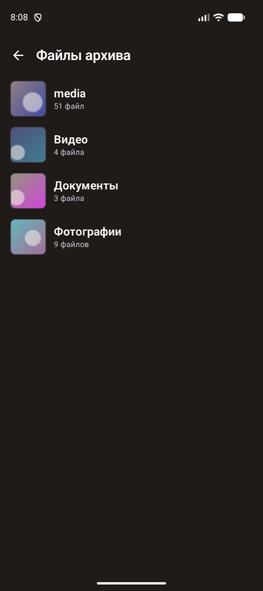</td>
    <td>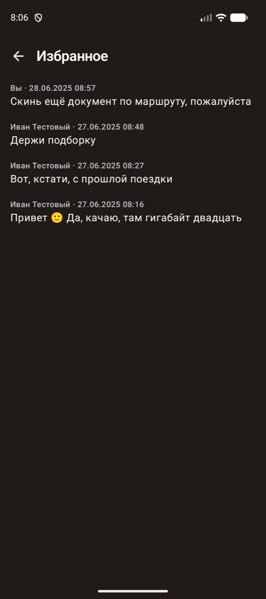</td>
    <td>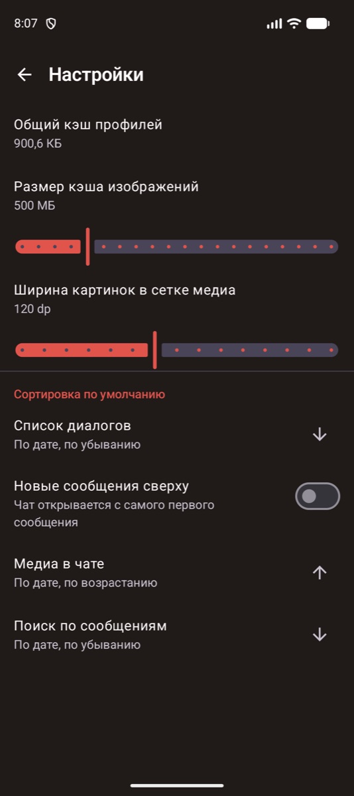</td>
  </tr>
</table>

---

## Возможности

### Импорт

- 📦 Импорт архива `.zip` / `.rar` или уже распакованной папки — формат определяется сам.
- 🧭 Автоопределение раскладки дампа: JSON-экспорт (`profile.json` + `messages/`) и три HTML-формата
  (`Диалоги/` классический, b00m, `Переписки/`).
- 🪆 Умный поиск «начала» экспорта внутри архива: вложенные папки и дважды запакованные дампы
  разворачиваются автоматически.
- ⏳ Импорт идёт в фоне (WorkManager) с уведомлением о прогрессе — приложение можно свернуть, а
  диалоги начинают появляться ещё до конца разбора.
- 👥 Несколько профилей одновременно: каждый дамп — отдельный профиль со своим хранилищем.
- 🗑️ Удаление профиля вместе со всеми его диалогами, сообщениями и файлами.

### Переписки

- 💬 Список диалогов с аватарками, количеством сообщений и категориями из дампа.
- 🔎 Поиск диалогов по имени и полнотекстовый поиск по сообщениям (Room FTS) с переходом к
  найденному сообщению прямо в чате.
- ↕️ Сортировка: по дате, имени, числу сообщений, отправителю — по возрастанию и убыванию.
- 🔁 Разворот порядка сообщений в чате (с начала переписки или с последнего сообщения).
- ⭐ Избранные сообщения — отдельный экран по всему профилю.
- 🧵 Пересланные и цитируемые сообщения разбираются вместе с их вложениями.
- 👨‍👩‍👧 Личные диалоги и беседы, включая имена участников.

### Вложения и медиа

- 🖼️ Вкладки чата: сообщения, фото, видео, аудио, файлы.
- 🎞️ Просмотрщик фото с листанием и переходом к сообщению, из которого пришло вложение.
- ▶️ Встроенный проигрыватель видео на Media3 / ExoPlayer.
- 🧲 Сканер «осиротевших» медиа: фото и видео, на которые не ссылается ни один диалог, всё равно
  находятся и группируются по папкам архива.
- 💾 Сохранение вложений на телефон (в `Download/`), включая Android 7–9 и MediaStore на новых версиях.
- 🧩 Типы вложений: фото, видео, аудио и голосовые, документы, стикеры, граффити, ссылки, посты со
  стены, звонки.

### Профиль

- 👤 Карточка владельца дампа: аватар, ID, дата рождения, пол, страна, город, короткое имя.
- 🧑‍🤝‍🧑 Друзья и группы с поиском по имени.
- 🌄 Сохранённые фотографии и все вложения профиля одной сеткой.
- 📁 «Файлы архива» — исходные папки дампа с превью и счётчиком файлов.

### Настройки

- 🧹 Общий кэш профилей и размер кэша изображений (100–2000 МБ).
- 🔳 Ширина картинок в сетке медиа (60–200 dp).
- ↕️ Сортировка по умолчанию для списка диалогов, медиа в чате и поиска по сообщениям.
- 🔝 Переключатель «новые сообщения сверху».
- 🌗 Material 3, светлая и тёмная тема по системной настройке.
- 🌍 Русский и английский интерфейс (per-app language).

---

## Скачать

Последняя версия доступна в разделе **GitHub Releases**:

<p align="center">
  <a href="https://github.com/Helandy/VK-DUMP-Reader/releases/latest">
    
  </a>
</p>

### Как пользоваться

1. Получите выгрузку ВКонтакте (официальный экспорт или дамп сторонним инструментом).
2. Положите архив на телефон — например, в папку «Загрузки».
3. Откройте приложение, нажмите **+** → **Выбрать архив** и укажите файл.
   Если экспорт уже распакован — **Выбрать папку**.
4. Разрешите уведомления, чтобы видеть прогресс импорта в фоне (необязательно).
5. Дождитесь окончания разбора — диалоги появляются по мере импорта.

> [!NOTE]
> Большие дампы (десятки гигабайт, сотни тысяч сообщений) импортируются несколько минут: архив
> копируется в память приложения целиком, поэтому нужно примерно столько же свободного места,
> сколько занимает распакованный дамп.

---

## Для разработчиков

Проект на Kotlin, Jetpack Compose и Hilt, разбит на модули по чистой архитектуре
(`domain` / `data` / `presentation`), UI построен по MVI (`State` / `Event` / `Effect`).

### Структура

- `core/*` — общие подсистемы:
  - `model` — доменные модели и enum-ы;
  - `common` — MVI-база, диспетчеры, работа с файлами, обработка ошибок;
  - `archive` — распаковка (zip4j / junrar), определение формата, парсеры дампов, фоновый воркер импорта;
  - `storage` — Room: профили, диалоги, сообщения (+FTS), вложения, друзья, группы, сохранённые фото;
  - `designsystem` — тема, типографика, общие компоненты и медиа-элементы;
  - `navigation` — типобезопасные маршруты и навигационный менеджер;
  - `settings` — DataStore-настройки и подсчёт кэша.
- `features/*` — пользовательские сценарии: `home`, `importer`, `dialogs`, `chat`, `profile`,
  `favorites`, `settings`.

### Стек

Kotlin · Jetpack Compose (Material 3) · Hilt · Room + FTS · WorkManager · DataStore · Coil ·
Media3 / ExoPlayer · Jsoup · zip4j · junrar · kotlinx.serialization

### Сборка

```bash
./gradlew :app:assembleDebug
```

Минимальная версия Android — 7.0 (API 24).

---

## Ограничения

- Приложение только **читает** дампы: оно не скачивает архивы из ВКонтакте и не умеет авторизоваться.
- Разбираются те форматы выгрузок, которые встречались автору. Незнакомая раскладка импортируется
  как «просто папка с медиа»: фото и видео найдутся, переписка — нет.
- Ссылки на удалённые файлы (фото и видео, лежащие в дампе только ссылкой на серверы ВК) без
  интернета не откроются, а со временем перестают открываться совсем.
- Архив копируется в память приложения целиком, поэтому большой дамп займёт на телефоне столько же
  места, сколько занимает сам.

---

## ☕ Поддержать проект

VK DUMP Reader разрабатывается и поддерживается независимо.

Если вам нравится приложение и вы хотите помочь его дальнейшему развитию:

[](https://boosty.to/etozhesandy)

Также можно поддержать проект бесплатно:

* ⭐ **Поставить Star репозиторию** — это помогает другим узнать о проекте
* 🐞 **Сообщить об ошибке** через [Issues](https://github.com/Helandy/VK-DUMP-Reader/issues)
* 💡 **Предложить улучшение** через [Issues](https://github.com/Helandy/VK-DUMP-Reader/issues)

---

## Disclaimer

- VK DUMP Reader — неофициальное приложение, никак не связанное с ВКонтакте.
- Приложение не скачивает, не хранит на серверах и не распространяет контент: оно читает только тот
  архив, который вы выбрали сами.
- Все данные остаются на устройстве. Все права на содержимое дампа принадлежат его владельцам.
